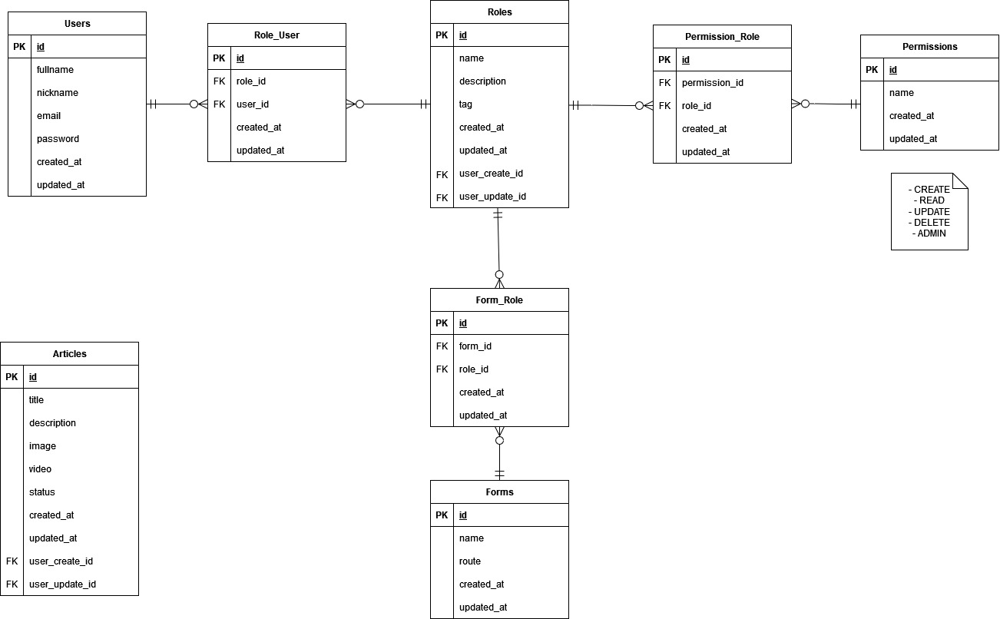
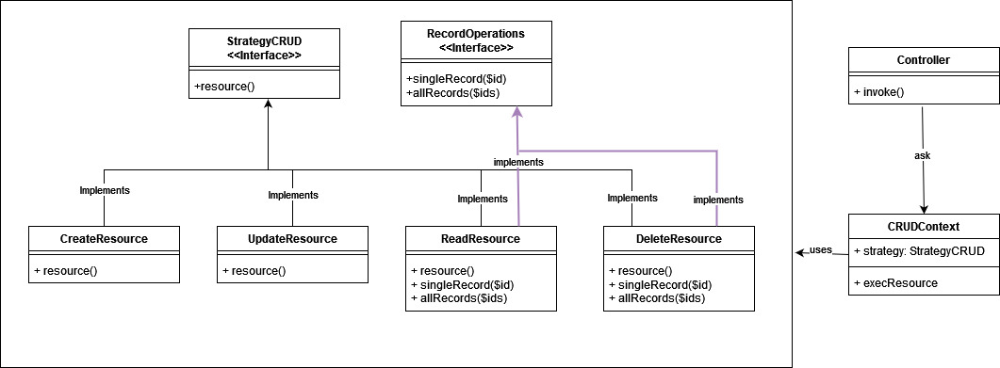
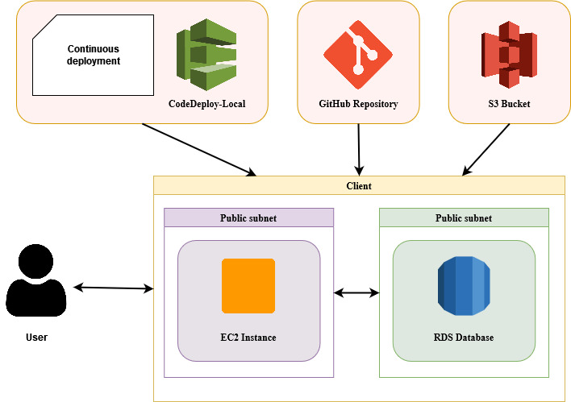

# CMS API PROJECT

# Propósito del CMS

El propósito de este CMS construido es proporcionar una plataforma robusta para la gestión de contenido, especialmente enfocada en la creación, edición, borrado y lectura de datos de artículos y roles. Se han desarrollado varias API's que permiten realizar estas operaciones de manera eficiente.

## Tecnología Principal Utilizada

La tecnología principal utilizada para construir estas API's fue Laravel. Laravel ofrece un conjunto de herramientas poderosas que permiten crear rápidamente API's RESTful, facilitando la generación de una capa de abstracción más grande para el desarrollo.

## Arquitectura de Software Implementado

El software implementado sigue una arquitectura modular y escalable. Se han creado varios CRUDs y, si en el futuro se desea implementar uno nuevo, simplemente se puede seguir el mismo esquema de creación que se ha utilizado hasta ahora.

### Modelo Relacional

Cabe recalcar que las tablas Roles y Articles tienen foraneas hacia Usuario, esto con el fin de tener auditoria de la informacion

### Diagrama de Clases

Esta arquitectura se implementó para los controladores y sus servicios. Asimismo, se sigue un esquema similar para los middlewares de cada ruta, con el objetivo de tener una única ruta para cada operación CRUD. Dependiendo del método de solicitud, esta ruta se dirige al servicio correspondiente.

### API's y Pruebas

Actualmente, se han creado varias API's que son accesibles a través de Postman para el almacenamiento de datos de ejemplo. Puedes acceder a ellas [aquí](https://app.getpostman.com/join-team?invite_code=916cb4df4a8eb0d17db1b54e0c0a8a40&target_code=5d0fcd519e3bb5f15e6a5c3d0aac5573).

Todas las API's están listas para realizar pruebas unitarias y de integración.

## Arquitectura de Despliegue

Para el despliegue del sitio, se utilizó Amazon Web Service (AWS). La arquitectura de despliegue sigue un enfoque altamente disponible y escalable para garantizar la disponibilidad del sitio en todo momento.

Es importante destacar que subir información a la rama main es un evento para realizar el despliegue continuo del sitio. La configuración para este proceso se puede encontrar en el archivo `appsec.yml`.

El enlace de visualización del desarrollo, donde se encuentran almacenadas cada una de las API's, es el siguiente: [CMS](http://ec2-3-147-71-99.us-east-2.compute.amazonaws.com/)

